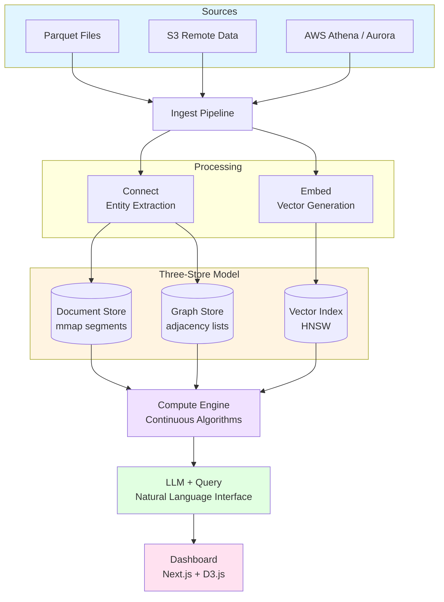

# stupid-db

**A continuous knowledge materialization engine that unifies document, vector, and graph databases behind a single ingestion interface.**

stupid-db transforms raw event logs into queryable knowledge by continuously processing, connecting, and analyzing data across three storage paradigms simultaneously. Instead of choosing between document, vector, or graph databases, you get all three — automatically synchronized and continuously computed.

## Why stupid-db?

Traditional analytics systems force you to choose your database paradigm upfront and manually maintain consistency across multiple stores. stupid-db eliminates this friction:

- **Single write interface** — Insert a document once, get document storage, vector embeddings, and graph relationships automatically
- **Continuous materialization** — Knowledge is computed in the background, not on-demand when you query
- **Time-partitioned segments** — Built for high-volume streaming data with automatic 15-30 day rolling windows
- **LLM-native querying** — Ask questions in natural language, get structured insights and visualizations
- **AWS-integrated** — Query Athena, enrich from Aurora/RDS, read remote parquet from S3

## Key Features

### Three Stores, One Write

```rust
// Insert once
db.insert(document).await?;

// Automatically get:
// 1. Document storage (mmap'd MessagePack segments)
// 2. Vector embeddings (HNSW index for semantic search)
// 3. Graph relationships (in-memory property graph)
```

### Continuous Compute Engine

Background algorithms continuously materialize knowledge:
- **Clustering** — K-Means (streaming + batch), DBSCAN
- **Graph Analysis** — PageRank, Louvain communities, centrality metrics
- **Pattern Detection** — Temporal sequences (PrefixSpan), co-occurrence, trends
- **Anomaly Detection** — Multi-signal scoring across statistical, behavioral, and graph signals

### Chat-First Dashboard

Natural language queries powered by OpenAI/Claude/Ollama:

```
User: "Show me login anomalies from the last 24 hours"

stupid-db: [Generates D3.js visualization + structured insights]
```

Built with Next.js + D3.js, no authentication required (designed for internal/trusted networks).

### Remote Data Access

Read parquet files from anywhere:
- **Local filesystem** — Direct mmap for zero-copy reads
- **S3** — DuckDB-style HTTP range requests
- **Athena** — Query AWS Athena as an enrichment source
- **Aurora/RDS** — Enrich graph with relational data

## Architecture



See [docs/architecture/overview.md](./docs/architecture/overview.md) for detailed architecture.

## Tech Stack

### Backend (Rust)
- **Runtime:** tokio (async I/O) + rayon (parallel compute)
- **Storage:** arrow-rs/parquet + memmap2 (mmap segments)
- **Vector Index:** HNSW (usearch or hnsw_rs)
- **Embeddings:** ONNX Runtime (local) + Ollama/OpenAI (remote)
- **Server:** axum (REST + SSE + WebSocket)
- **AWS:** aws-sdk-s3, aws-sdk-athena

### Frontend (TypeScript)
- **Framework:** Next.js 16 + React 19
- **Visualization:** D3.js 7.x
- **Styling:** Tailwind CSS 4.x

See [docs/project/tech-stack.md](./docs/project/tech-stack.md) for complete dependency list.

## Getting Started

### Prerequisites

**Development:**
- Rust 1.75+ and cargo
- Node.js 20+ and npm
- 8GB RAM, 200GB SSD

**Production:**
- 16+ cores, 64GB+ RAM, 5TB+ NVMe

### Installation

```bash
# Clone the repository
git clone https://github.com/yourusername/stupid-db.git
cd stupid-db

# Build the backend
cargo build --release

# Install dashboard dependencies
cd dashboard
npm install
cd ..
```

### Running

```bash
# Start the backend server
./target/release/stupid-db --config config/default.toml

# In another terminal, start the dashboard
cd dashboard
npm run dev
```

Visit `http://localhost:3000` to access the dashboard.

### Sample Data

The project includes sample data analysis from a real-world dataset (104GB, ~960K events/day). See [docs/data/sample-profile.md](./docs/data/sample-profile.md) for details on the data schema and entity model.

## Project Structure

```
stupid-db/
├── crates/              # Rust workspace (11 crates)
│   ├── core/           # Shared types and traits
│   ├── segment/        # Time-partitioned storage
│   ├── graph/          # In-memory property graph
│   ├── ingest/         # Data ingestion pipeline
│   ├── connector/      # Entity extraction + graph edges
│   ├── compute/        # Continuous algorithms
│   ├── catalog/        # Schema and knowledge catalog
│   ├── llm/            # LLM backend integration
│   ├── storage/        # Storage abstractions
│   ├── athena/         # AWS Athena connector
│   └── server/         # HTTP/WebSocket API (main binary)
│
├── dashboard/          # Next.js frontend
│   ├── app/           # App Router pages
│   ├── components/    # React components
│   └── lib/           # D3.js visualizations
│
├── docs/              # Comprehensive documentation
│   ├── architecture/  # Architecture decisions and design
│   ├── ingestion/     # Data ingestion docs
│   ├── compute/       # Compute algorithms docs
│   ├── query/         # Query planning and LLM integration
│   ├── dashboard/     # Dashboard component docs
│   └── project/       # Project structure and tech stack
│
└── config/            # Configuration files
```

See [docs/project/crate-map.md](./docs/project/crate-map.md) for detailed crate descriptions.

## Documentation

Comprehensive documentation is available in the `docs/` directory:

- **[Architecture Overview](./docs/architecture/overview.md)** — System design and core principles
- **[Data Flow](./docs/architecture/data-flow.md)** — End-to-end pipeline from source to query
- **[Storage Model](./docs/architecture/storage/segment-model.md)** — Time-partitioned segments and eviction
- **[Compute Engine](./docs/compute/overview.md)** — Continuous algorithms and scheduling
- **[Query Interface](./docs/query/overview.md)** — Natural language queries and LLM integration
- **[Dashboard](./docs/dashboard/overview.md)** — Chat interface and D3.js visualizations

Start with [docs/INDEX.md](./docs/INDEX.md) for the full documentation index.

## Architecture Decision Records

Key architectural decisions are documented in [docs/architecture/decisions/](./docs/architecture/decisions/):

- [ADR-001: Why Rust](./docs/architecture/decisions/adr-001-language-rust.md)
- [ADR-002: Why Segments](./docs/architecture/decisions/adr-002-segment-storage.md)
- [ADR-003: Why Continuous Compute](./docs/architecture/decisions/adr-003-continuous-compute.md)
- [ADR-004: Why LLM Query Interface](./docs/architecture/decisions/adr-004-llm-query-interface.md)

## Design Philosophy

1. **Compute over storage** — Optimize for processing speed, not persistence durability
2. **Single source of truth** — One write creates all representations
3. **Rolling windows** — Data has a TTL; eviction is O(1) segment deletion
4. **Background materialization** — Knowledge is pre-computed, not on-demand
5. **LLM-first** — Natural language is the primary query interface
6. **No premature optimization** — Start simple, profile, then optimize hot paths

## Development

### Building

```bash
# Build all crates
cargo build --release

# Build specific crate
cargo build -p stupid-db-server --release

# Run tests
cargo test

# Run with development watching
cargo watch -x run
```

### Frontend Development

```bash
cd dashboard
npm run dev        # Development server
npm run build      # Production build
npm run lint       # Run ESLint
```

## Contributing

This is currently a personal project in active development. Contributions are welcome once the initial architecture stabilizes.

## System Requirements

| Resource | Development | Production |
|----------|-------------|------------|
| **CPU** | 4 cores | 16+ cores |
| **RAM** | 8 GB | 64+ GB |
| **Disk** | 200 GB SSD | 5+ TB NVMe |
| **GPU** | Optional | Optional (for ONNX GPU embedding) |
| **OS** | Windows/Linux/macOS | Linux preferred |

## Why "stupid-db"?

Because it's stupid simple: insert data once, get three databases for free. No manual syncing, no dual writes, no choosing between paradigms. The complexity is hidden behind continuous background compute, not exposed to the user.

---

**Status:** Active development. Core architecture complete, implementation in progress.
