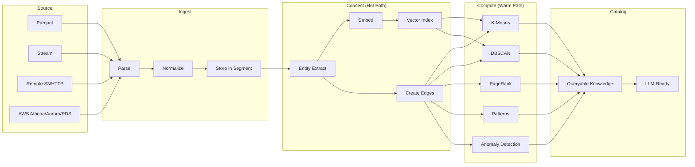

# Data Flow

## End-to-End Pipeline



## Phase 1: Ingest

**Input**: Parquet files (daily partitioned), streaming events, remote parquet over HTTP/S3.

**Process**:
1. Read parquet batch (Arrow RecordBatch)
2. Normalize schema — all fields are strings in the raw data, apply type inference where possible
3. Assign segment ID based on `@timestamp` (1 segment = 1 day, configurable)
4. Write document to current segment's mmap'd store
5. Return document ID to hot-path connector

**Output**: Stored document with `(segment_id, doc_id, timestamp)`.

**Throughput target**: ~100-170 GB/day at full scale (3-5TB / 30 days).

## Phase 2: Connect (Hot Path)

Runs synchronously on each ingested batch. Must keep pace with ingest throughput.

**Process**:
1. **Entity extraction** — pull known entity fields from the document:
   - `memberCode` → Member node
   - `fingerprint` + `platform` + `deviceModel` → Device node
   - `game` + `gameUid` + `category` → Game node
   - `affiliateId` → Affiliate node
   - `currency` → Currency node
   - `rGroup` → VIP Group node
   - `error` + `stage` → Error node (for API Error events)
2. **Edge creation** — create typed edges between entities:
   - Member → `logged_in_from` → Device
   - Member → `opened` → Game
   - Member → `saw` → Popup
   - Member → `hit_error` → Error
   - Member → `belongs_to` → VIP Group
   - Member → `referred_by` → Affiliate
3. **Embedding generation** — generate vector embedding for the event:
   - Concatenate key fields into a text representation
   - Run through embedder (local ONNX or remote API)
   - Insert into segment's HNSW index
4. **Streaming cluster update** — feed feature vector to mini-batch K-means

**Output**: Graph nodes + edges, vector index entry, cluster assignment.

## Phase 3: Compute (Warm Path)

Runs continuously in background. Operates on batches of data, not individual events.

**Process** (see [../compute/](../compute/) for algorithm details):
- Clustering (K-means, DBSCAN) on member behavior vectors
- Graph algorithms (PageRank, Louvain community detection)
- Temporal pattern mining (frequent sequences)
- Co-occurrence matrix computation
- Anomaly detection (statistical outliers, DBSCAN noise points)
- Trend detection (week-over-week comparisons)

**Output**: Computed knowledge — cluster assignments, community IDs, anomaly flags, pattern catalog.

## Phase 4: Eviction

Runs periodically (hourly or daily).

**Process**:
1. Identify segments older than retention window (default 30 days)
2. Remove all graph edges referencing that segment's documents
3. Drop the segment's vector index
4. Delete/unmap the segment file — O(1), no compaction needed

**Key property**: No tombstones, no GC pauses. The entire segment is the unit of eviction.

## Data Lifecycle

```
Day 0: Event arrives
  → Stored in today's segment
  → Entities extracted, edges created
  → Embedded, indexed
  → Fed to streaming K-means

Day 0-30: Event is live
  → Participates in all compute passes
  → Queryable via document scan, vector search, graph traversal
  → May be flagged as anomalous, assigned to cluster, part of pattern

Day 30: Segment expires
  → Entire segment dropped
  → Edges cleaned up
  → Vector index removed
  → Computed results (cluster stats, patterns) may be archived separately
```

## Backpressure

If ingest outpaces the hot-path connector:
1. Connector queue depth increases
2. At threshold, ingest slows down (bounded channel)
3. Warm-path compute is deprioritized to free CPU for hot path
4. Never drop data — slow down intake instead
