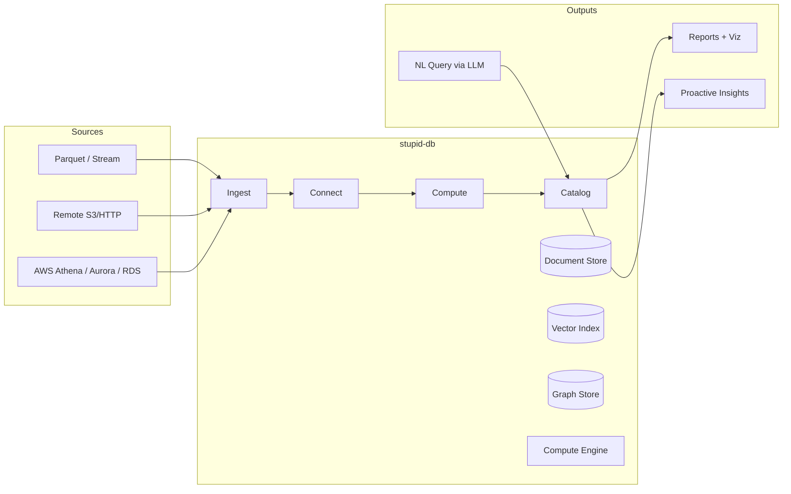

# Architecture Overview

stupid-db is a **continuous knowledge materialization engine** that unifies three database paradigms — document, vector, and graph — behind a single ingestion interface. Raw event data (parquet files, streams) flows in through one door and gets continuously transformed into queryable knowledge.

## Core Thesis

Raw event logs are fuel, not the product. The product is the **computed knowledge** that emerges from continuously processing, connecting, and analyzing those events across all three storage paradigms simultaneously.

## System Boundaries

## The Three Stores

| Store | Purpose | Backing |
|-------|---------|---------|
| **Document** | Raw event storage, filtered scans, projections | Time-partitioned mmap segments |
| **Vector** | Semantic similarity, embedding-based search, clustering input | Per-segment HNSW index |
| **Graph** | Entity relationships, traversals, community structure | In-memory property graph (adjacency list) |

All three are populated automatically from a single document insert. The user never interacts with vector or graph stores directly — they emerge from the ingestion pipeline.

## Design Principles

1. **Single write interface** — insert a document, get all three representations for free
2. **Continuous compute** — algorithms run perpetually in the background, not on-demand
3. **Time-partitioned segments** — data has a 15-30 day TTL, eviction is O(1) segment drop
4. **Compute over storage** — optimize for processing speed, not persistence durability
5. **LLM-native query** — natural language in, structured reports + visualizations out
6. **Remote-capable** — read parquet from S3/HTTP like DuckDB's httpfs
7. **AWS-integrated** — query Athena, read from Aurora/RDS as enrichment sources

## Data Flow

See [data-flow.md](./data-flow.md) for the detailed pipeline.

## Key Subsystems

| Subsystem | Docs | Description |
|-----------|------|-------------|
| Storage | [storage/](./storage/) | Segment model, document store, vector index, graph store |
| Ingestion | [../ingestion/](../ingestion/) | Parquet reading, entity extraction, embedding, edge creation |
| Compute | [../compute/](../compute/) | Continuous algorithms — clustering, graph analysis, patterns |
| Query | [../query/](../query/) | LLM-powered natural language → query plan → execution |
| Dashboard | [../dashboard/](../dashboard/) | Next.js + D3.js chat-based analytics interface |
| AWS Integration | [storage/aws-integration.md](./storage/aws-integration.md) | Athena, Aurora, RDS connectivity |
