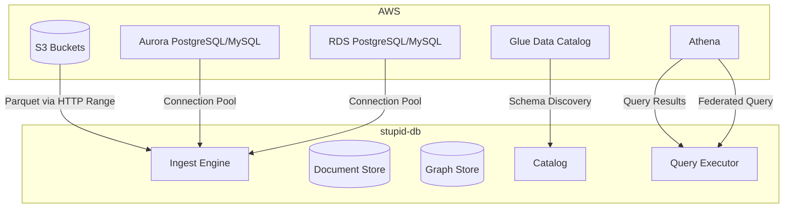
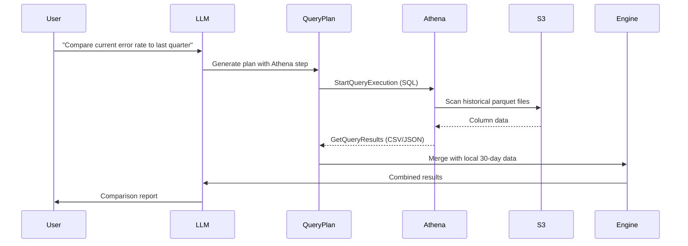
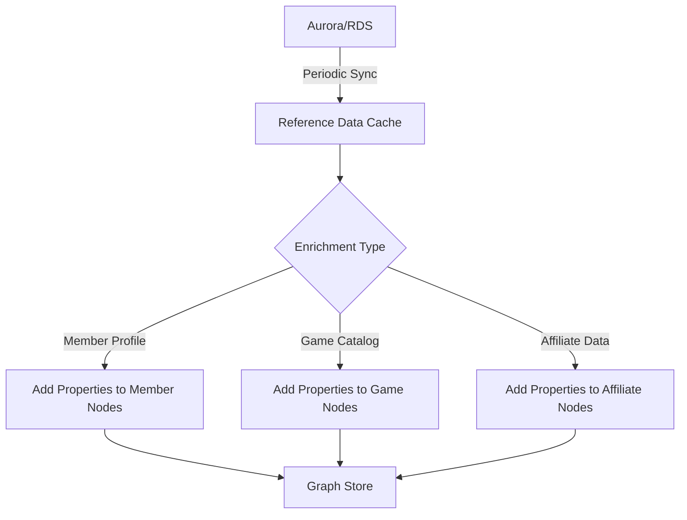

# AWS Integration

## Overview

stupid-db integrates with AWS data services to read from and query external data sources. This enables enriching the local knowledge graph with relational data from Aurora/RDS and querying historical/archival data via Athena — without importing everything locally.

## Integration Architecture



## AWS Athena Integration

### Purpose
Query **archival and historical data** stored in S3 as parquet without importing it. Athena is serverless — no infrastructure to manage, pay per query.

### Use Cases
- Query data older than the 30-day retention window
- Ad-hoc analysis across months/years of historical data
- Cross-reference local knowledge with historical baselines
- Federated queries: "compare current clusters to clusters from 6 months ago"

### Configuration

```toml
[aws.athena]
enabled = true
region = "ap-southeast-1"
database = "analytics"
workgroup = "stupid-db"
output_location = "s3://stupid-db-athena-results/"
# Max scan per query (cost control)
max_scan_bytes = 10737418240  # 10 GB
# Query timeout
timeout_seconds = 300
```

### How It Works



### Query Plan Step

```json
{
  "id": "s3",
  "store": "athena",
  "op": "query",
  "params": {
    "sql": "SELECT date_trunc('day', timestamp) as day, count(*) as error_count FROM events WHERE event_type = 'API Error' AND timestamp BETWEEN '2024-10-01' AND '2024-12-31' GROUP BY 1 ORDER BY 1",
    "max_scan_gb": 5
  }
}
```

### Athena Table Registration

Register S3 parquet paths as Athena tables via Glue:

```sql
CREATE EXTERNAL TABLE IF NOT EXISTS events (
    memberCode STRING,
    eventName STRING,
    platform STRING,
    currency STRING,
    rGroup STRING,
    `@timestamp` STRING,
    -- ... other fields
)
PARTITIONED BY (event_type STRING, dt STRING)
STORED AS PARQUET
LOCATION 's3://w88-analytics/events/'
TBLPROPERTIES ('parquet.compression'='SNAPPY');
```

### Cost Control

- **Max scan limit** per query (configurable, default 10GB)
- **Partition pruning** — always include event_type and date in WHERE clause
- **Column pruning** — only SELECT needed columns
- **Result caching** — Athena caches results for 24h by default
- **Usage tracking** — dashboard shows Athena query costs

## Aurora / RDS Integration

### Purpose
Read **relational reference data** — member profiles, game catalogs, affiliate configurations, VIP tier rules. This data enriches the graph with attributes that aren't in the event stream.

### Use Cases
- Member profile enrichment: registration date, total deposits, account status
- Game catalog: game names, categories, providers, RTP values
- Affiliate hierarchy: parent affiliates, commission tiers
- VIP rules: tier thresholds, benefits

### Configuration

```toml
[aws.aurora]
enabled = true
engine = "postgresql"  # or "mysql"
host = "stupid-db-cluster.cluster-xxxx.ap-southeast-1.rds.amazonaws.com"
port = 5432
database = "crm"
username_env = "AURORA_USERNAME"
password_env = "AURORA_PASSWORD"
# Connection pool
pool_min = 2
pool_max = 10
# SSL
ssl_mode = "require"

[aws.rds]
enabled = true
engine = "mysql"
host = "api-red-db.xxxx.ap-southeast-1.rds.amazonaws.com"
port = 3306
database = "apired"
username_env = "RDS_USERNAME"
password_env = "RDS_PASSWORD"
pool_min = 2
pool_max = 5
ssl_mode = "require"
```

### Enrichment Pipeline



### Sync Modes

| Mode | Frequency | Use Case |
|------|-----------|----------|
| **Full sync** | Daily | Complete refresh of reference tables |
| **Incremental sync** | Every 15 min | Only rows modified since last sync |
| **On-demand** | Per query | Fetch specific records when needed |

### Schema Mapping

Map relational tables to graph entity properties:

```toml
[[aws.aurora.mappings]]
table = "members"
entity_type = "Member"
key_column = "member_code"
properties = [
    { column = "registration_date", property = "registered_at" },
    { column = "total_deposit", property = "total_deposit" },
    { column = "account_status", property = "status" },
    { column = "email_verified", property = "email_verified" },
    { column = "phone_verified", property = "phone_verified" },
]
sync_mode = "incremental"
sync_key = "updated_at"

[[aws.aurora.mappings]]
table = "games"
entity_type = "Game"
key_column = "game_uid"
properties = [
    { column = "display_name", property = "name" },
    { column = "category", property = "category" },
    { column = "provider", property = "provider" },
    { column = "rtp", property = "rtp" },
    { column = "is_active", property = "active" },
]
sync_mode = "full"
```

### Query Plan Step (Direct Query)

For ad-hoc queries, the plan can include direct Aurora/RDS queries:

```json
{
  "id": "s4",
  "store": "aurora",
  "op": "query",
  "params": {
    "sql": "SELECT member_code, registration_date, total_deposit FROM members WHERE member_code = ANY($1)",
    "bind": { "$1": { "ref": "s1", "field": "memberCode" } },
    "database": "crm"
  }
}
```

### Connection Pooling

Uses `bb8` (Rust async connection pool) with:
- Min connections kept warm
- Max connection limit
- Health checks on idle connections
- Automatic reconnection on failure

```rust
struct AwsDbPool {
    aurora: Option<Pool<PostgresConnectionManager>>,
    rds: Option<Pool<MysqlConnectionManager>>,
}
```

## S3 Integration (Direct)

Beyond Athena, stupid-db reads parquet directly from S3:

### Use Cases
- Import historical parquet files from S3
- Register S3 paths as external segments
- Archive computed results to S3
- Read remote data without Athena overhead (when full table scans are fine)

### Configuration

```toml
[aws.s3]
region = "ap-southeast-1"
# Authentication: uses default AWS credential chain
# (env vars, instance profile, SSO, etc.)

# Pre-registered S3 data sources
[[aws.s3.sources]]
bucket = "w88-analytics"
prefix = "events/"
event_type_from_path = true  # events/Login/2025-06-12.parquet → Login
pattern = "**/*.parquet"

[[aws.s3.sources]]
bucket = "w88-archive"
prefix = "historical/"
read_only = true
```

### S3 Parquet Reader

```rust
struct S3ParquetReader {
    client: aws_sdk_s3::Client,
    bucket: String,
    key: String,
    metadata: Option<ParquetMetadata>,
}

#[async_trait]
impl RemoteReader for S3ParquetReader {
    async fn read_range(&self, offset: u64, length: u64) -> Result<Bytes> {
        let range = format!("bytes={}-{}", offset, offset + length - 1);
        let resp = self.client
            .get_object()
            .bucket(&self.bucket)
            .key(&self.key)
            .range(range)
            .send()
            .await?;
        Ok(resp.body.collect().await?.into_bytes())
    }
}
```

## AWS Authentication

Uses the standard AWS credential chain:

1. Environment variables (`AWS_ACCESS_KEY_ID`, `AWS_SECRET_ACCESS_KEY`)
2. AWS SSO (`~/.aws/sso/cache/`)
3. AWS config file (`~/.aws/credentials`)
4. EC2 instance profile (when running on AWS)
5. ECS task role

No AWS credentials are stored in stupid-db configuration.

## Catalog Integration

AWS data sources appear in the knowledge catalog:

```json
{
  "external_sources": {
    "athena": {
      "enabled": true,
      "database": "analytics",
      "tables": ["events", "members", "games"],
      "estimated_data_gb": 450
    },
    "aurora": {
      "enabled": true,
      "database": "crm",
      "tables": ["members", "games", "affiliates"],
      "sync_mode": "incremental",
      "last_sync": "2025-07-12T14:00:00Z"
    },
    "rds": {
      "enabled": true,
      "database": "apired",
      "tables": ["sessions", "config"],
      "sync_mode": "on_demand"
    },
    "s3_sources": [
      {
        "bucket": "w88-analytics",
        "prefix": "events/",
        "file_count": 8400,
        "total_size_gb": 1200
      }
    ]
  }
}
```

The LLM knows about these sources and can generate plans that query them when the local 30-day window isn't sufficient.

## Rust Crate Dependencies

```toml
# In crates/ingest/Cargo.toml
[dependencies]
aws-config = "1"
aws-sdk-s3 = "1"
aws-sdk-athena = "1"

# In crates/server/Cargo.toml or a new crates/aws/ crate
[dependencies]
sqlx = { version = "0.8", features = ["postgres", "mysql", "runtime-tokio"] }
# or
tokio-postgres = "0.7"
mysql_async = "0.34"
bb8 = "0.8"
```
