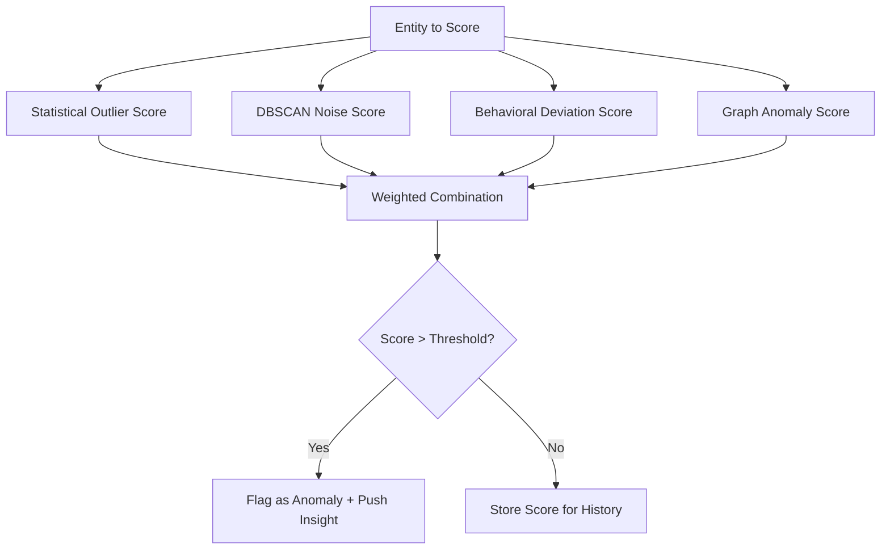

# Anomaly Detection

## Overview

Anomaly detection identifies unusual behavior at the member level, event level, and system level. It uses multiple signals: statistical outliers, DBSCAN noise points, behavioral deviation, and graph anomalies.

## Multi-Signal Anomaly Scoring

Each member/event gets an anomaly score from 0.0 (normal) to 1.0 (highly anomalous). The final score is a weighted combination of multiple detectors.



## Detectors

### 1. Statistical Outlier Detection

**Method**: Z-score on member feature vectors.

For each feature dimension, compute the mean and standard deviation across all members. A member is an outlier if any feature has |z| > 3.

```rust
fn statistical_anomaly_score(member: &MemberFeatures, population: &FeatureStats) -> f64 {
    let max_z = member.features.iter()
        .zip(population.means.iter().zip(population.stddevs.iter()))
        .map(|(val, (mean, std))| ((val - mean) / std).abs())
        .max();

    // Normalize to 0.0 - 1.0
    (max_z / 5.0).min(1.0)
}
```

**Weight**: 0.2
**Catches**: Members with extreme behavior on any single dimension (e.g., 100x more logins than average).

### 2. DBSCAN Noise Score

**Method**: Points classified as noise by DBSCAN (not in any dense cluster).

Events that don't belong to any cluster are unusual by definition — they don't match any known behavior pattern.

```rust
fn dbscan_noise_score(member_events: &[EventId], dbscan_result: &DbscanResult) -> f64 {
    let noise_count = member_events.iter()
        .filter(|e| dbscan_result.is_noise(e))
        .count();

    let noise_ratio = noise_count as f64 / member_events.len() as f64;
    noise_ratio // Already 0.0 - 1.0
}
```

**Weight**: 0.3
**Catches**: Events that don't match any established pattern — potential new behavior, bugs, or fraud.

### 3. Behavioral Deviation Score

**Method**: Compare a member's recent behavior to their own historical baseline.

```rust
fn behavioral_deviation_score(
    member: NodeId,
    recent_features: &[f64],   // Last 24h
    baseline_features: &[f64], // Previous 7-day average
) -> f64 {
    // Cosine distance between recent and baseline
    let similarity = cosine_similarity(recent_features, baseline_features);
    1.0 - similarity // Low similarity = high deviation
}
```

**Weight**: 0.3
**Catches**: Members whose behavior suddenly changed (e.g., a slot player suddenly playing only poker, or a daily user going silent).

### 4. Graph Anomaly Score

**Method**: Detect unusual graph patterns.

Signals:
- Member connecting to many new devices suddenly (device fingerprint proliferation)
- Member connecting to entities in a different community than their own
- Unusually high degree growth rate

```rust
fn graph_anomaly_score(member: NodeId, graph: &GraphStore) -> f64 {
    let mut score = 0.0;

    // New device connections in last 24h vs historical
    let recent_devices = graph.edges_since(member, EdgeType::LoggedInFrom, 24.hours.ago());
    let historical_device_rate = graph.avg_new_edges_per_day(member, EdgeType::LoggedInFrom);
    if recent_devices > historical_device_rate * 3.0 {
        score += 0.5;
    }

    // Cross-community connections
    let member_community = communities.get(&member);
    let neighbor_communities: HashSet<_> = graph.neighbors(member)
        .filter_map(|n| communities.get(&n))
        .collect();
    if neighbor_communities.len() > 3 {
        score += 0.3;
    }

    score.min(1.0)
}
```

**Weight**: 0.2
**Catches**: Account sharing (multiple devices), bot behavior (mechanical patterns), fraud (unusual connection patterns).

## Combined Score

```rust
fn anomaly_score(member: NodeId) -> f64 {
    let s1 = statistical_anomaly_score(member) * 0.2;
    let s2 = dbscan_noise_score(member) * 0.3;
    let s3 = behavioral_deviation_score(member) * 0.3;
    let s4 = graph_anomaly_score(member) * 0.2;
    s1 + s2 + s3 + s4
}
```

## Thresholds

| Score Range | Classification | Action |
|-------------|---------------|--------|
| 0.0 - 0.3 | Normal | None |
| 0.3 - 0.5 | Mildly unusual | Log, include in reports |
| 0.5 - 0.7 | Anomalous | Push as insight |
| 0.7 - 1.0 | Highly anomalous | High-priority insight + alert |

## Execution Schedule

| Detector | Priority | Frequency |
|----------|----------|-----------|
| Statistical | P1 | Every 5 minutes |
| DBSCAN noise | P1 | Every 5 minutes (piggybacks on DBSCAN) |
| Behavioral deviation | P2 | Hourly |
| Graph anomaly | P2 | Hourly |
| Combined scoring | P2 | After all detectors complete |

## Anomaly Insights

When a member crosses the threshold, an insight is generated:

```rust
struct AnomalyInsight {
    member: NodeId,
    score: f64,
    top_signals: Vec<(String, f64)>, // Which detectors fired highest
    description: String,             // LLM-generated explanation
    related_entities: Vec<NodeId>,   // Connected unusual entities
    first_detected: DateTime<Utc>,
    consecutive_detections: usize,   // How many cycles it's been anomalous
}
```

Example insight:
```
Member "xyz123" — Anomaly Score: 0.78
Top signals: DBSCAN noise (0.9), behavioral deviation (0.8)
"Member xyz123 has been flagged as highly anomalous. Their last 24h
events don't match any established behavior cluster, and their game
selection shifted dramatically from slots to live casino. They also
logged in from 4 new devices in the last 6 hours."
```
