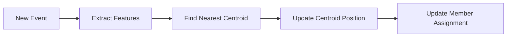
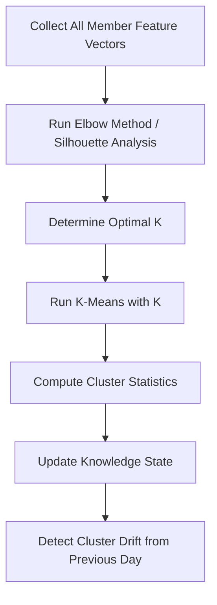
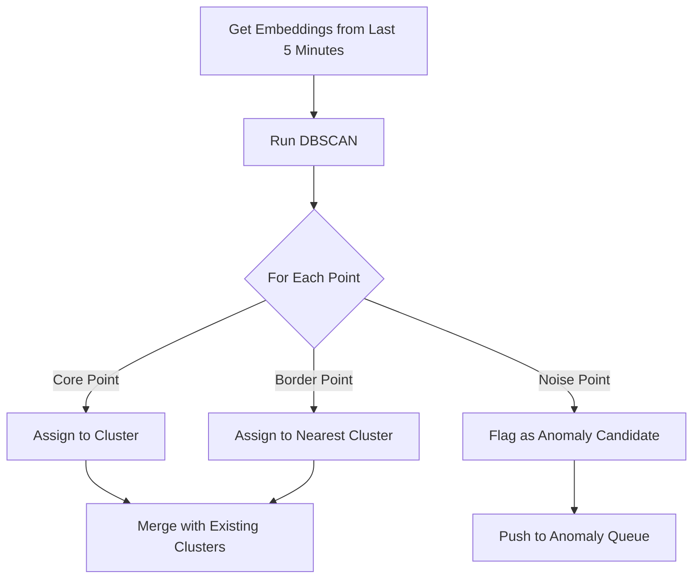

# Clustering Algorithms

## Overview

Clustering groups members and events by behavioral similarity. Three clustering approaches run at different priorities, each serving a different purpose.

## K-Means

### Purpose
Group members into behavioral segments based on aggregated activity features.

### Feature Vector

Each member accumulates a feature vector from their events:

| Feature | Source | Description |
|---------|--------|-------------|
| `login_count_7d` | Login events | Login frequency |
| `game_count_7d` | GameOpened events | Total games opened |
| `unique_games_7d` | GameOpened events | Game variety |
| `error_count_7d` | API Error events | Error frequency |
| `popup_clicks_7d` | PopupModule events | Popup engagement |
| `mobile_ratio` | All events (platform) | Mobile vs desktop usage |
| `session_count_7d` | Derived (session gaps) | Session frequency |
| `avg_session_gap_h` | Derived (timestamps) | Time between sessions |
| `vip_tier` | rGroup field | Numeric VIP level |
| `currency_encoded` | currency field | One-hot or ordinal |

### Streaming K-Means (P0)

Runs on every ingested event. Updates centroids incrementally.



**Algorithm**: Mini-batch K-means with decay
- Maintain K centroids (K determined by full K-means, default 10)
- For each new member feature vector:
  1. Find nearest centroid
  2. Move centroid slightly toward the point: `centroid += learning_rate * (point - centroid)`
  3. Assign member to that cluster
- Learning rate decays over time to stabilize clusters

**Complexity**: O(K * d) per event, where d = feature dimensions. ~10 microseconds.

### Full K-Means Recompute (P3)

Runs daily. Recomputes clusters from scratch with optimal K.



**Optimal K selection**: Run K-means for K = 2..20, compute silhouette score for each, pick K with highest score.

**Cluster statistics stored**:
```rust
struct ClusterInfo {
    id: ClusterId,
    centroid: Vec<f64>,
    member_count: usize,
    // Feature means and stddevs for interpretation
    feature_means: Vec<f64>,
    feature_stddevs: Vec<f64>,
    // Top entities in this cluster
    top_games: Vec<(String, usize)>,
    top_platforms: Vec<(String, usize)>,
    top_currencies: Vec<(String, usize)>,
    top_vip_groups: Vec<(String, usize)>,
    // Human-readable label (LLM-generated)
    label: Option<String>,
}
```

### Cluster Labeling

After K-means, an LLM generates human-readable labels:

```
Input: Cluster 3: avg 12 games/day, 95% mobile, 80% VND,
       top games: [slots_fortune, slots_golden], VIP tier: VIPG-VIPB

Output: "High-frequency Vietnamese mobile slot players (mid-tier VIP)"
```

## DBSCAN

### Purpose
Detect **dense clusters and outliers** in recent event embeddings. Unlike K-means, DBSCAN doesn't require pre-specifying K and can find arbitrarily shaped clusters. Points not in any cluster are flagged as **noise** (potential anomalies).

### Parameters

| Parameter | Default | Description |
|-----------|---------|-------------|
| `eps` | 0.3 | Maximum distance between points in a cluster |
| `min_pts` | 5 | Minimum points to form a cluster |

### Execution (P1, every 5 minutes)



### Use Cases

- **Bot detection**: Bots produce tightly clustered, repetitive event embeddings
- **Unusual behavior**: Events in noise (no cluster) are unusual
- **Emerging patterns**: New clusters forming = new behavior pattern

## Cluster Comparison

| Aspect | K-Means | DBSCAN |
|--------|---------|--------|
| Input | Member feature vectors | Event embeddings |
| Granularity | Per-member | Per-event |
| K required? | Yes (auto-determined) | No |
| Handles noise? | No | Yes (core feature) |
| Priority | P0 (streaming) + P3 (full) | P1 (batch) |
| Purpose | Member segmentation | Anomaly detection, pattern discovery |
| Update frequency | Every event (streaming) | Every 5 minutes |
