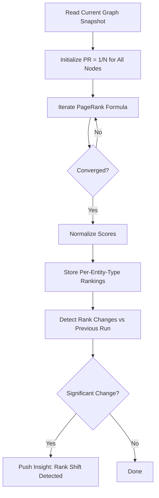
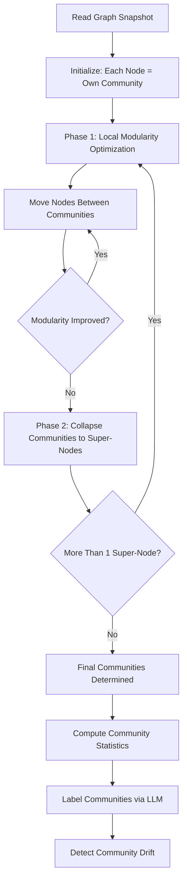

# Graph Algorithms

## Overview

Graph algorithms run on the in-memory property graph to discover structure, influence, and communities in the member-entity network.

## PageRank

### Purpose
Identify the most **influential** or **central** entities in the graph. High PageRank members are well-connected hubs; high PageRank games are popular across segments.

### Algorithm

Standard PageRank with damping factor:

```
PR(v) = (1 - d) / N + d * SUM(PR(u) / out_degree(u)) for all u linking to v
```

Where:
- `d` = 0.85 (damping factor)
- `N` = total nodes
- Converges after ~20-50 iterations

### Configuration

| Parameter | Default | Description |
|-----------|---------|-------------|
| `damping` | 0.85 | Probability of following a link vs random jump |
| `max_iterations` | 50 | Maximum iterations before stopping |
| `convergence_threshold` | 1e-6 | Stop when max delta < threshold |
| `edge_weight` | true | Use edge weights (occurrence count) |

### Execution (P2, hourly)



### Output

```rust
struct PageRankResult {
    scores: HashMap<NodeId, f64>,
    // Top entities per type
    top_members: Vec<(NodeId, f64)>,     // Most connected members
    top_games: Vec<(NodeId, f64)>,       // Most popular games
    top_devices: Vec<(NodeId, f64)>,     // Most common devices
    rank_changes: Vec<RankChange>,       // Significant moves since last run
    iterations: usize,
    converged: bool,
}
```

### Weighted PageRank

Edge weights (occurrence counts) are incorporated:

- Member logs in from Device 50 times → edge weight 50
- Member opens Game once → edge weight 1
- PageRank flows more through high-weight edges
- This means "primary device" and "favorite game" contribute more

## Louvain Community Detection

### Purpose
Discover **natural communities** — groups of entities that are more densely connected to each other than to the rest of the graph. Think: "these 500 members form a cohesive group based on their game choices, devices, and VIP tiers."

### Algorithm

Louvain method (modularity optimization):

1. Start: each node is its own community
2. For each node, try moving it to each neighbor's community
3. Pick the move that maximizes modularity gain
4. Repeat until no improvement
5. Collapse communities into super-nodes
6. Repeat from step 2 on the super-graph

### Execution (P2, hourly)



### Output

```rust
struct CommunityResult {
    assignments: HashMap<NodeId, CommunityId>,
    communities: Vec<CommunityInfo>,
    modularity_score: f64,
    num_communities: usize,
}

struct CommunityInfo {
    id: CommunityId,
    member_count: usize,
    // Dominant traits
    top_games: Vec<(String, f64)>,
    top_platforms: Vec<(String, f64)>,
    top_currencies: Vec<(String, f64)>,
    top_vip_groups: Vec<(String, f64)>,
    // Internal connectivity
    internal_edge_density: f64,
    // LLM-generated label
    label: Option<String>,
}
```

### Community Labels (LLM-Generated)

```
Community 7: 2,340 members, 89% mobile, 76% THB, top games: [poker, baccarat]
→ "Thai mobile card game enthusiasts"

Community 12: 890 members, 95% desktop, 92% VND, top games: [slots_*], VIPG+
→ "Vietnamese high-VIP desktop slot regulars"
```

## Shortest Path

### Purpose
Answer "how are entity A and entity B connected?" — used by the query layer for ad-hoc relationship exploration.

### Algorithm
Weighted Dijkstra with edge weights inverted (high weight = short distance, because frequent connections are "closer").

### Execution: On-demand (not scheduled)

```rust
fn shortest_path(from: NodeId, to: NodeId) -> Option<Vec<(NodeId, EdgeId)>>
```

Used in queries like: "How is member X connected to game Y?" → shows the path through the graph.

## Graph Statistics

Maintained continuously and exposed to the dashboard:

```rust
struct GraphStats {
    total_nodes: usize,
    total_edges: usize,
    nodes_by_type: HashMap<EntityType, usize>,
    edges_by_type: HashMap<EdgeType, usize>,
    avg_degree: f64,
    max_degree: (NodeId, usize),
    connected_components: usize,
    density: f64,
}
```
