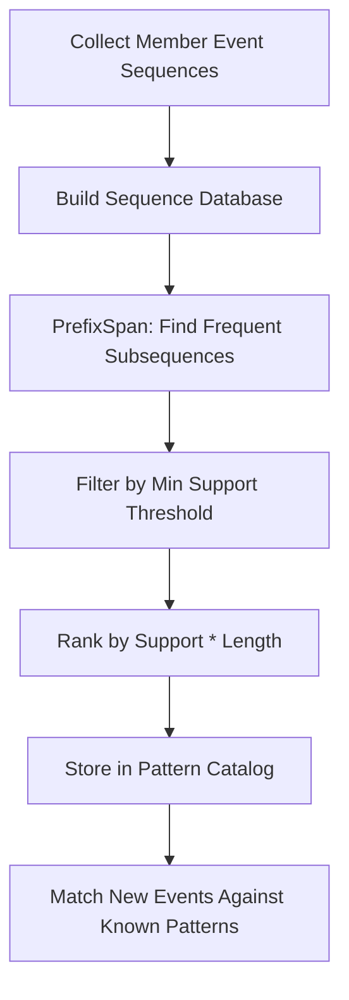
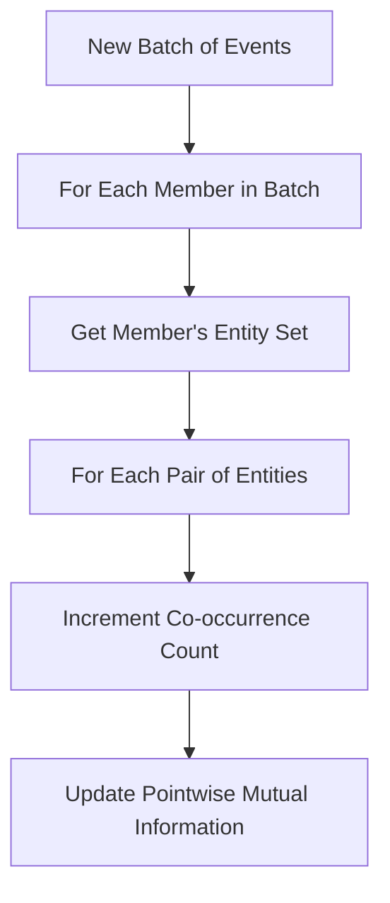

# Pattern Detection

## Overview

Pattern detection discovers recurring sequences, correlations, and trends in the event stream. It answers questions like "what typically happens before a member churns?" or "which game pairs are always played together?"

## Temporal Sequence Mining

### Purpose
Find frequent event sequences per member. Example: "Login → API Error → no GameOpened for 48h" = churn signal.

### Algorithm: PrefixSpan (Sequential Pattern Mining)



### Sequence Representation

Member events are compressed into typed sequences:

```
Member thongtran2904 (last 7 days):
[Login, Login, GameOpened:Slots, GameOpened:Slots, PopupModule:click,
 Login, APIError:auth, Login, APIError:auth]

Compressed:
[L, L, G:S, G:S, P:c, L, E:auth, L, E:auth]
```

### Configuration

| Parameter | Default | Description |
|-----------|---------|-------------|
| `min_support` | 0.01 | Minimum fraction of members exhibiting the pattern |
| `max_length` | 10 | Maximum sequence length |
| `time_window` | 7d | Window for collecting sequences |
| `min_members` | 50 | Minimum member count for a pattern |

### Execution (P3, daily)

1. For each active member, collect their event sequence for the time window
2. Run PrefixSpan to find frequent subsequences
3. Filter and rank patterns
4. Compare with previous day's patterns to detect new/disappeared patterns
5. Store in pattern catalog

### Output

```rust
struct TemporalPattern {
    id: PatternId,
    sequence: Vec<EventTypeCompressed>,
    support: f64,           // Fraction of members
    member_count: usize,    // Absolute count
    avg_duration: Duration, // Average time span of the sequence
    first_seen: DateTime<Utc>,
    // Classification
    category: PatternCategory, // Churn, Engagement, Error, Funnel
    // LLM-generated description
    description: Option<String>,
}

enum PatternCategory {
    Churn,       // Leads to inactivity
    Engagement,  // Leads to increased activity
    ErrorChain,  // Cascading errors
    Funnel,      // Conversion sequence
    Unknown,
}
```

## Co-Occurrence Analysis

### Purpose
Discover which entities frequently appear together. "Members who play Game A also play Game B." "Members on platform X tend to use currency Y."

### Algorithm: Co-Occurrence Matrix

For each entity type pair (e.g., Game × Game), maintain a sparse matrix counting how many members connect to both:

```
         Slots_A  Slots_B  Poker_C  Baccarat_D
Slots_A     -       850      120        40
Slots_B    850       -       90         35
Poker_C    120      90        -        560
Baccarat_D  40      35       560        -
```

### Execution (P1, every 5 minutes — incremental update)



### PMI Scoring

Raw co-occurrence is biased toward popular entities. Use Pointwise Mutual Information:

```
PMI(A, B) = log2(P(A,B) / (P(A) * P(B)))
```

- PMI > 0: A and B co-occur more than expected (interesting)
- PMI ≈ 0: Independent (boring)
- PMI < 0: A and B co-occur less than expected (also interesting — avoidance)

### Supported Entity Pairs

| Pair | Insight |
|------|---------|
| Game × Game | Which games are played together |
| Game × Platform | Game preference by platform |
| Game × VipGroup | Game preference by VIP tier |
| Error × Platform | Platform-specific error patterns |
| Error × Game | Game-specific error patterns |
| Affiliate × Currency | Affiliate performance by market |

## Trend Detection

### Purpose
Detect significant changes in key metrics compared to baseline. "Login rate dropped 30% today vs 7-day average."

### Metrics Tracked

| Metric | Granularity | Baseline |
|--------|------------|----------|
| Events per hour (by type) | Hourly | 7-day rolling average |
| Unique members per hour | Hourly | 7-day rolling average |
| Error rate | Hourly | 7-day rolling average |
| Cluster sizes | Daily | Previous day |
| Community count | Daily | Previous day |
| New members | Daily | 7-day rolling average |

### Detection Method

Z-score against rolling baseline:

```
z = (current_value - baseline_mean) / baseline_stddev
```

- |z| > 2: Notable (logged)
- |z| > 3: Significant (pushed as insight)
- |z| > 4: Critical (high-priority insight)

### Execution (P2, hourly)

```mermaid
flowchart TD
    A[Compute Current Hour Metrics] --> B[Load 7-Day Baseline]
    B --> C[Calculate Z-Scores]
    C --> D{Any |z| > 3?}
    D -->|Yes| E[Generate Trend Insight]
    D -->|No| F[Log Metrics for Future Baseline]
    E --> F
```

### Output

```rust
struct Trend {
    metric: String,
    current_value: f64,
    baseline_mean: f64,
    baseline_stddev: f64,
    z_score: f64,
    direction: TrendDirection, // Up, Down, Stable
    severity: Severity,        // Notable, Significant, Critical
    since: DateTime<Utc>,
}
```
