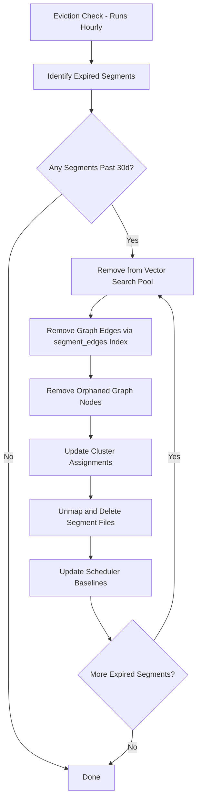

# Eviction

## Overview

Eviction removes expired data from all three stores (document, vector, graph) and cleans up computed results. The system maintains a 15-30 day rolling window. Eviction is designed to be fast, non-disruptive, and atomic at the segment level.

## Eviction Process



## Step-by-Step

### 1. Remove from Search Pool

```rust
fn evict_vector_index(segment_id: &SegmentId) {
    // Remove segment from the list of searchable indices
    search_pool.remove(segment_id);
    // The HNSW index file will be deleted with the segment
}
```

Instant — just removes a reference. No data movement.

### 2. Remove Graph Edges

```rust
fn evict_graph_edges(segment_id: &SegmentId, graph: &mut GraphStore) {
    if let Some(edge_ids) = graph.segment_edges.remove(segment_id) {
        for edge_id in edge_ids {
            graph.remove_edge(edge_id);
        }
    }
}
```

Complexity: O(edges_in_segment). For a segment with ~1M events creating ~3M edges, this takes milliseconds.

### 3. Remove Orphaned Nodes

After edge removal, some nodes may have zero connections:

```rust
fn remove_orphaned_nodes(graph: &mut GraphStore) {
    let orphans: Vec<NodeId> = graph.nodes.iter()
        .filter(|(id, _)| {
            graph.outgoing.get(id).map_or(true, |e| e.is_empty())
            && graph.incoming.get(id).map_or(true, |e| e.is_empty())
        })
        .map(|(id, _)| *id)
        .collect();

    for node_id in orphans {
        graph.nodes.remove(&node_id);
        graph.key_index.remove(&node_id);
    }
}
```

### 4. Update Computed Results

```rust
fn evict_computed_results(segment_id: &SegmentId, state: &mut KnowledgeState) {
    // Members only in this segment lose their cluster assignments
    // (members also in other segments retain theirs)
    for (node_id, cluster_id) in state.clusters.iter() {
        if node_only_in_segment(node_id, segment_id) {
            state.clusters.remove(node_id);
        }
    }

    // Trigger cluster recount (lightweight)
    state.recount_clusters();

    // Anomaly flags for evicted members are removed
    state.anomalies.retain(|k, _| !node_only_in_segment(k, segment_id));
}
```

### 5. Delete Segment Files

```rust
fn delete_segment(segment_id: &SegmentId) {
    let path = format!("{}/segments/{}", data_dir, segment_id);
    std::fs::remove_dir_all(path)?;
}
```

## Eviction Timing

| Action | Duration | Notes |
|--------|----------|-------|
| Remove from search pool | < 1ms | Pointer removal |
| Remove graph edges | ~50ms | For ~3M edges |
| Remove orphaned nodes | ~10ms | Scan and delete |
| Update computed results | ~20ms | Filter and recount |
| Delete files | ~100ms | OS file deletion |
| **Total per segment** | **< 200ms** | |

## Configuration

```toml
[eviction]
retention_days = 30
check_interval_hours = 1
# Optional: archive computed results before eviction
archive_insights = true
archive_path = "./data/archive"
```

## Archiving (Optional)

Before evicting, optionally archive computed results:

- Cluster statistics for the period
- Anomaly history
- Pattern catalog
- Insight summaries

Archived data is read-only and queryable for historical analysis ("what were the clusters like 60 days ago?") but does not participate in live compute.
