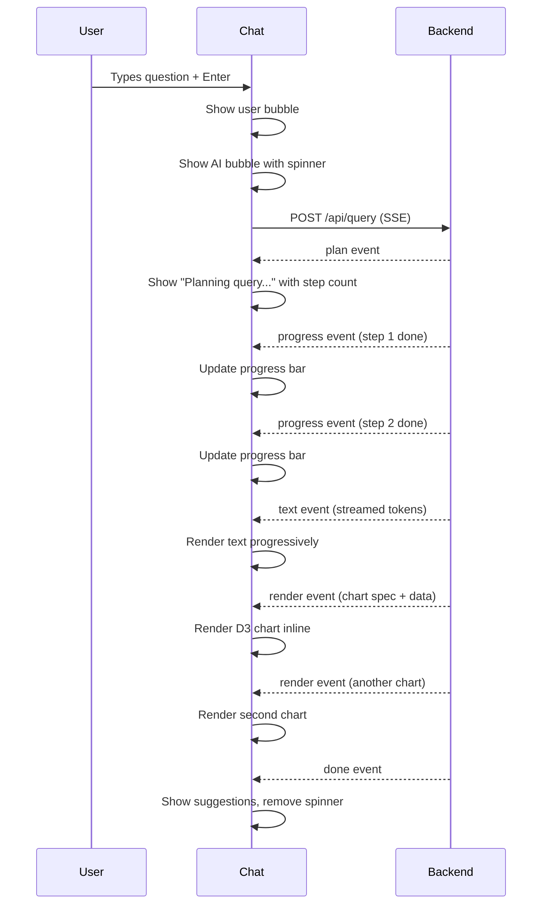

# Chat Interface

## Overview

The chat interface is the primary user interaction surface. It functions like a data analyst you can talk to — ask questions, get reports with visualizations, follow up with refinements.

## Layout

```
┌─────────────────────────────────────────────────────────────────┐
│  stupid-db                                      [Export] [Clear] │
├─────────────────────────────────────────────┬───────────────────┤
│                                             │                    │
│  ┌─ Messages ─────────────────────────────┐ │ Pinned Insights    │
│  │                                         │ │                    │
│  │  [User]  Which members had errors       │ │ ● Anomaly: 3x     │
│  │          last week and stopped playing?  │ │   error spike      │
│  │                                         │ │                    │
│  │  [AI]    Found 342 members...           │ │ ● Cluster shift:   │
│  │                                         │ │   VIPG shrinking   │
│  │          ┌─ Bar Chart ─────────┐        │ │                    │
│  │          │ ▇ ▅ ▃ ▇ ▅ ▃ ▂      │        │ │ ● New pattern:     │
│  │          │ Mon-Sun              │        │ │   Game funnel      │
│  │          └─────────────────────┘        │ │                    │
│  │                                         │ │ ● Trend: Login     │
│  │          ┌─ Graph ─────────────┐        │ │   rate +15%        │
│  │          │  ○──○──○            │        │ │                    │
│  │          │   \  |  /           │        │ │──────────────────  │
│  │          │    ○──○             │        │ │                    │
│  │          └─────────────────────┘        │ │ System Status      │
│  │                                         │ │ ● Compute: active  │
│  │          Top segments: VIPB (41%)...    │ │ ● Ingest: 142/s    │
│  │                                         │ │ ● Segments: 28/30  │
│  │          Suggested follow-ups:          │ │ ● Anomalies: 23    │
│  │          → "Compare to healthy cohort"  │ │                    │
│  │          → "Show me the error timeline" │ │                    │
│  │          → "Export affected members"    │ │                    │
│  │                                         │ │                    │
│  └─────────────────────────────────────────┘ │                    │
│                                             │                    │
│  ┌─ Input ─────────────────────────────────┐ │                    │
│  │ Ask anything about the data...    [Send]│ │                    │
│  └─────────────────────────────────────────┘ │                    │
└─────────────────────────────────────────────┴───────────────────┘
```

## Message Types

### User Message
Plain text question.

### AI Response
Contains multiple blocks:

```typescript
interface AIResponse {
  text: string;               // Summary text
  renderBlocks: RenderBlock[]; // Inline visualizations
  suggestions: string[];       // Follow-up question suggestions
  metadata: {
    plan_steps: number;
    execution_time_ms: number;
    documents_scanned: number;
  };
}

interface RenderBlock {
  type: 'bar_chart' | 'line_chart' | 'scatter' | 'force_graph' |
        'sankey' | 'heatmap' | 'treemap' | 'table' | 'summary';
  title: string;
  data: any[];
  config: Record<string, any>;  // Chart-specific config
}
```

## Streaming UX

As the backend processes, the UI shows progressive updates:



## Follow-up Suggestions

Each response includes clickable follow-up questions:

```typescript
// Generated by LLM based on the current results
const suggestions = [
  "Compare these members to the healthy cohort",
  "Show the error timeline with hourly granularity",
  "Which games are most affected?",
  "Export the list as CSV"
];
```

Clicking a suggestion sends it as the next message — the session context carries forward.

## Interaction Features

### Click-to-Explore
- Click a member in a chart → "Tell me about member {memberCode}"
- Click a cluster in scatter plot → "Show me cluster {id} details"
- Click a node in force graph → "What's connected to {entity}?"
- Click a bar in timeline → "Drill into {date}"

### Export
- **CSV**: Any table or result set → download as CSV
- **PNG/SVG**: Any D3 chart → right-click → export as image
- **Report link**: Save the conversation as a shareable permalink

### Query History
Recent queries are stored in localStorage:
```typescript
interface QueryHistory {
  queries: Array<{
    question: string;
    timestamp: string;
    session_id: string;
  }>;
}
```

## Input Enhancements

### Auto-suggestions
As the user types, suggest completions based on:
- Entity names from the catalog ("member tho..." → "thongtran2904")
- Event types ("show me login..." → "Login events")
- Computed knowledge ("clusters..." → "cluster details")
- Previous queries

### Quick Commands
Prefixes for power users:
- `@member thongtran2904` → "Tell me everything about member thongtran2904"
- `@cluster 3` → "Show cluster 3 details"
- `@anomalies` → "List current anomalies"
- `@trends` → "Show active trend alerts"
- `@export` → "Export last result as CSV"

## Session Management

```typescript
interface Session {
  id: string;
  messages: Message[];
  created_at: string;
  // Named result sets for back-references
  result_sets: Record<string, any>;
}

// New session on page load, or resume from URL
// GET /reports/{session_id} → load previous conversation
```
