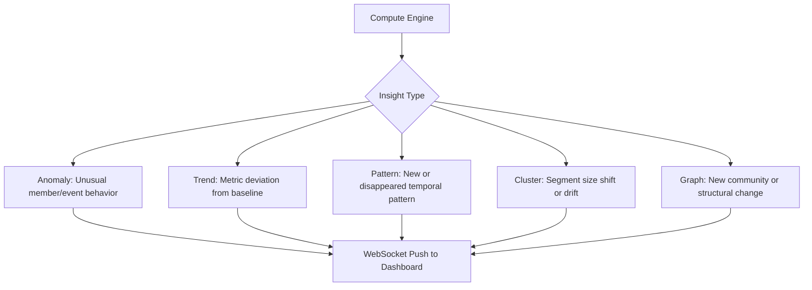

# Proactive Insights

## Overview

The insights system pushes discoveries from the compute engine to the dashboard in real-time. These appear in the sidebar without the user asking — the system tells you what it found.

## Insight Types



## Insight Schema

```typescript
interface Insight {
  id: string;
  type: 'anomaly' | 'trend' | 'pattern' | 'cluster' | 'graph';
  severity: 'info' | 'warning' | 'critical';
  title: string;          // Short title for sidebar
  description: string;    // Longer explanation
  timestamp: string;
  // Optional: data for inline mini-visualization
  miniViz?: {
    type: 'sparkline' | 'mini_bar' | 'badge';
    data: any;
  };
  // Click action: sends this as a chat query
  drillDownQuery?: string;
}
```

## Examples

### Anomaly Insight
```json
{
  "type": "anomaly",
  "severity": "warning",
  "title": "3x API error spike",
  "description": "API errors jumped from 14K/hr to 42K/hr in the last 2 hours. Concentrated in auth-service stage.",
  "miniViz": { "type": "sparkline", "data": [14, 15, 14, 16, 28, 42] },
  "drillDownQuery": "Show me the API error spike in the last 2 hours"
}
```

### Trend Insight
```json
{
  "type": "trend",
  "severity": "info",
  "title": "Login rate +15%",
  "description": "Login rate is 15% above 7-day baseline. Strongest in THB currency.",
  "miniViz": { "type": "badge", "data": { "value": "+15%", "color": "green" } },
  "drillDownQuery": "Show login trends vs baseline"
}
```

### Pattern Insight
```json
{
  "type": "pattern",
  "severity": "info",
  "title": "New funnel: Popup → Slots",
  "description": "Discovered pattern: PopupModule click → GameOpened (Slots) within 30s. Seen in 2,340 members.",
  "drillDownQuery": "Tell me about the Popup to Slots funnel pattern"
}
```

### Cluster Insight
```json
{
  "type": "cluster",
  "severity": "warning",
  "title": "VIPG segment shrinking",
  "description": "Cluster 'VN high-VIP slot regulars' lost 12% of members this week vs last week.",
  "miniViz": { "type": "mini_bar", "data": [100, 95, 91, 88] },
  "drillDownQuery": "Show me the VIPG cluster trend and where members went"
}
```

## Sidebar UI

```typescript
// InsightFeed component
function InsightFeed({ insights }: { insights: Insight[] }) {
  return (
    <div className="insight-feed">
      {insights.map(insight => (
        <InsightCard
          key={insight.id}
          insight={insight}
          onClick={() => sendChatMessage(insight.drillDownQuery)}
        />
      ))}
    </div>
  );
}
```

### InsightCard Mini-Visualizations

| Mini-Viz Type | Rendering | Use Case |
|--------------|-----------|----------|
| `sparkline` | Tiny SVG line chart (80×20px) | Time-series trends |
| `mini_bar` | Tiny bar chart (80×20px) | Distribution changes |
| `badge` | Colored badge with value | Single metric change |

## WebSocket Protocol

```typescript
// Client
const ws = new WebSocket('ws://localhost:8080/ws/insights');

// Server pushes insight events
ws.onmessage = (event) => {
  const msg = JSON.parse(event.data);
  switch (msg.type) {
    case 'insight':
      addInsight(msg.insight);
      break;
    case 'insight_resolved':
      removeInsight(msg.insight_id);
      break;
    case 'system_status':
      updateStatus(msg.status);
      break;
  }
};
```

## System Status Widget

Below the insights, show system health:

```typescript
interface SystemStatus {
  compute_active: boolean;
  ingest_rate: number;        // docs/sec
  segments_active: number;
  segments_total: number;
  anomaly_count: number;
  last_compute_run: string;
  worker_utilization: number; // 0.0 - 1.0
}
```

Displayed as a compact status panel with colored indicators.

## Insight Lifecycle

1. **Created**: Compute engine detects something, pushes to insight queue
2. **Pushed**: Sent to dashboard via WebSocket
3. **Pinned**: Shown in sidebar until resolved or dismissed
4. **Clicked**: User clicks → sends drill-down query to chat
5. **Resolved**: Condition no longer holds (e.g., error spike subsides) → removed
6. **Dismissed**: User manually dismisses

Insights auto-resolve after their condition returns to normal. Dismissed insights don't reappear for the same condition within 24 hours.
