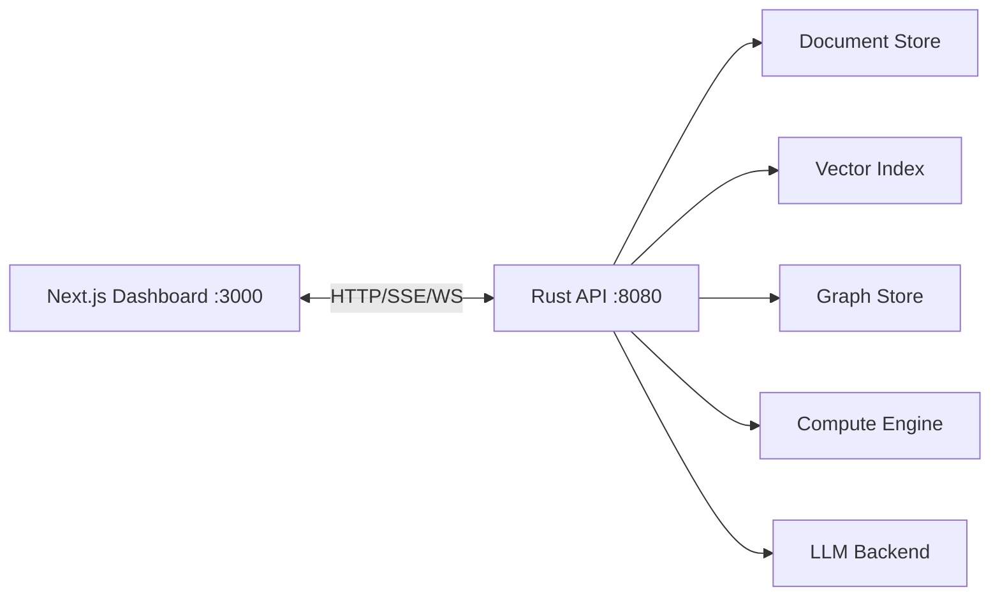
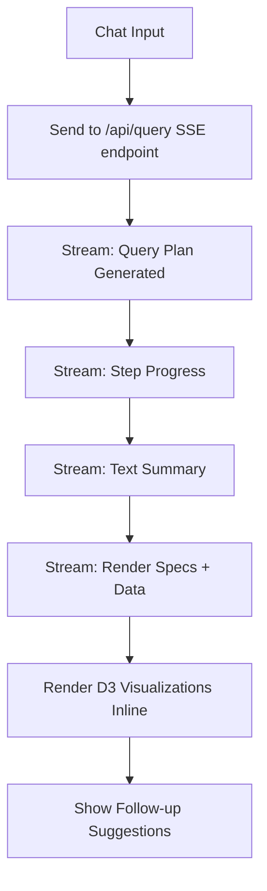

# Dashboard Overview

## Overview

The dashboard is a **Next.js + D3.js** application that serves as the primary user interface. It is fundamentally a **chat-based AI analyst** — the user asks questions in natural language and gets reports with inline visualizations, not a traditional BI dashboard with static panels.

## Architecture



## Core Interface

The main view is a **chat window** with rich inline content:



## Pages

| Route | Purpose |
|-------|---------|
| `/` | Main chat interface + pinned insights sidebar |
| `/reports/[id]` | Saved report (permalink to a conversation result) |

The dashboard is intentionally minimal — **one primary page** (the chat). No complex navigation, no configuration screens, no auth.

## Tech Stack

| Component | Technology | Why |
|-----------|-----------|-----|
| Framework | Next.js 14+ (App Router) | SSR for initial load, client-side for interactivity |
| Visualization | D3.js | Full control over data visualization, no abstraction limits |
| Styling | Tailwind CSS | Fast styling, dark mode support |
| State | React Context + useReducer | Simple, no external state lib needed |
| Streaming | EventSource (SSE) | Native browser API for server-sent events |
| WebSocket | Native WebSocket | For live insight feed |
| Charts | D3.js (custom components) | See [components/](./components/) |

## Communication with Rust Backend

### Query (SSE Stream)

```typescript
// POST /api/query → SSE stream
const response = await fetch('http://localhost:8080/api/query', {
  method: 'POST',
  headers: { 'Content-Type': 'application/json' },
  body: JSON.stringify({
    session_id: sessionId,
    question: "Which members churned after errors?"
  })
});

const reader = response.body.getReader();
// Read SSE events: plan, progress, text, render, done
```

### Live Insights (WebSocket)

```typescript
const ws = new WebSocket('ws://localhost:8080/ws/insights');
ws.onmessage = (event) => {
  const insight = JSON.parse(event.data);
  // { type: "anomaly", score: 0.78, member: "xyz", description: "..." }
  addToPinnedInsights(insight);
};
```

### Catalog Browse (REST)

```typescript
const catalog = await fetch('http://localhost:8080/api/catalog').then(r => r.json());
// Used for search suggestions, schema exploration
```

## Response Rendering

The dashboard receives **render specs** from the backend and maps them to D3 components:

```typescript
function renderBlock(spec: RenderSpec, data: any[]): React.ReactNode {
  switch (spec.type) {
    case 'summary':     return <InsightCard data={data} title={spec.title} />;
    case 'bar_chart':   return <BarChart data={data} x={spec.x} y={spec.y} title={spec.title} />;
    case 'line_chart':  return <LineChart data={data} x={spec.x} y={spec.y} title={spec.title} />;
    case 'scatter':     return <ScatterPlot data={data} title={spec.title} />;
    case 'force_graph': return <ForceGraph data={data} title={spec.title} />;
    case 'sankey':      return <SankeyDiagram data={data} title={spec.title} />;
    case 'heatmap':     return <Heatmap data={data} title={spec.title} />;
    case 'treemap':     return <Treemap data={data} title={spec.title} />;
    case 'table':       return <DataTable data={data} columns={spec.columns} />;
  }
}
```

## Design Principles

1. **Chat-first** — the primary interaction is natural language, not clicks
2. **Inline visualizations** — charts appear in the conversation, not in separate panels
3. **No auth** — local development tool, no security needed
4. **Dark mode default** — easier on the eyes for analysts
5. **Responsive** — works on laptop screens, no mobile needed
6. **Fast** — SSE streaming means the user sees progress immediately
7. **Exportable** — any result can be exported as CSV, any chart as PNG/SVG
