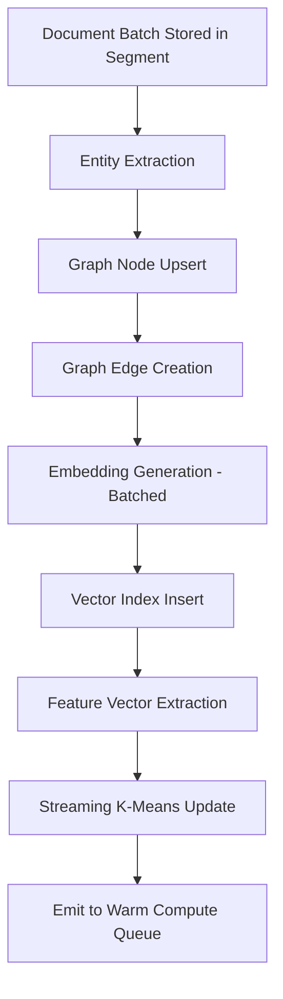

# Connector (Hot Path)

## Overview

The connector is the hot-path processing component that runs synchronously with ingestion. For every batch of documents stored, it extracts entities, creates graph edges, generates embeddings, and feeds streaming algorithms.

## Connector Pipeline



## Batch Processing

The connector operates on batches, not individual documents, for efficiency:

```rust
struct ConnectorBatch {
    documents: Vec<(DocAddress, Document)>,
    segment_id: SegmentId,
}

fn process_batch(batch: ConnectorBatch, state: &mut KnowledgeState) -> ConnectorResult {
    let mut entities_created = 0;
    let mut edges_created = 0;
    let mut embeddings_texts = Vec::new();

    for (addr, doc) in &batch.documents {
        // 1. Entity extraction
        let entities = extract_entities(doc);
        for entity in &entities {
            state.graph.upsert_node(entity);
            entities_created += 1;
        }

        // 2. Edge creation
        let edges = derive_edges(doc, &entities);
        for (src, dst, edge_type) in &edges {
            state.graph.add_edge(*src, *dst, *edge_type, batch.segment_id);
            edges_created += 1;
        }

        // 3. Collect for batch embedding
        let text_repr = doc.to_text_repr();
        embeddings_texts.push((*addr, text_repr));

        // 4. Streaming K-means
        if let Some(member_id) = doc.member_node_id() {
            let features = extract_feature_vector(doc);
            state.streaming_kmeans.update(member_id, features);
        }
    }

    // 5. Batch embed all at once
    let texts: Vec<&str> = embeddings_texts.iter().map(|(_, t)| t.as_str()).collect();
    let embeddings = state.embedder.embed_batch(&texts)?;
    for ((addr, _), embedding) in embeddings_texts.iter().zip(embeddings) {
        state.vector_index.insert(addr, embedding);
    }

    // 6. Notify warm compute
    state.warm_queue.push(WarmEvent::BatchProcessed {
        segment_id: batch.segment_id,
        doc_count: batch.documents.len(),
    });

    ConnectorResult { entities_created, edges_created, vectors_created: embeddings_texts.len() }
}
```

## Performance Budget

For a batch of 1000 documents:

| Step | Target | Notes |
|------|--------|-------|
| Entity extraction | 50ms | 1000 × 50us |
| Node upserts | 20ms | Hash lookups |
| Edge creation | 30ms | ~3 edges per doc × 10us |
| Text representation | 10ms | String formatting |
| Batch embedding (ONNX) | 100ms | 1000 docs in ~16 batches of 64 |
| Vector insert | 50ms | HNSW incremental |
| Feature extraction + K-means | 20ms | |
| **Total** | **~280ms** | **~3,500 docs/sec per core** |

With parallel processing across cores, target throughput: **15,000-30,000 docs/sec**.

## Error Recovery

- If entity extraction fails for a document, the document is still stored (it's already in the segment). A retry marker is set.
- If embedding fails (e.g., Ollama timeout), the batch is queued for re-embedding.
- Graph operations are idempotent (upsert semantics) — safe to retry.

## Monitoring

```rust
struct ConnectorMetrics {
    batches_processed: u64,
    documents_processed: u64,
    entities_created: u64,
    edges_created: u64,
    embeddings_generated: u64,
    avg_batch_duration_ms: f64,
    embedding_queue_depth: usize,
    errors: u64,
}
```
