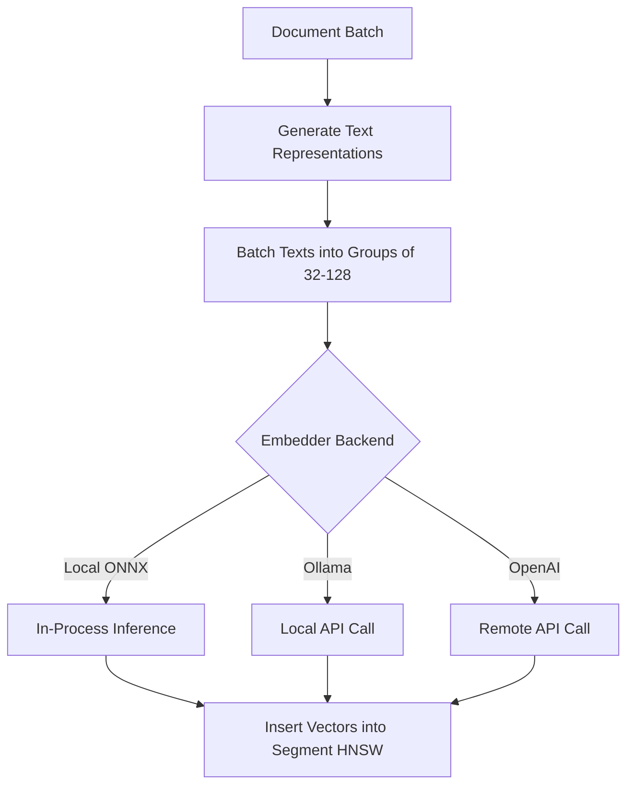

# Embedding Generation

## Overview

Every document gets a vector embedding for semantic similarity search, clustering, and anomaly detection. Embedding runs on the hot path but is the most expensive operation — batching and model selection are critical.

## Text Representation

Before embedding, a document is converted to a structured text string. Only semantically meaningful fields are included.

### Templates Per Event Type

**Login**:
```
Login member:{memberCode} platform:{platform} currency:{currency}
vip:{rGroup} success:{success} method:{method} device:{device}
```

**GameOpened**:
```
GameOpened member:{memberCode} game:{game} category:{category}
provider:{gameTrackingProvider} platform:{platform} from:{from}
currency:{currency} vip:{rGroup}
```

**API Error**:
```
APIError stage:{stage} error:{error_truncated_100chars}
platform:{platform} page:{page} status:{status}
member:{memberCode}
```

**PopupModule**:
```
Popup member:{memberCode} type:{popupType} click:{clickType}
component:{componentId} game:{game} platform:{platform}
```

### Why Structured Text?

- Embedding models understand natural-ish text better than raw JSON
- Field prefixes (`member:`, `game:`) help the model associate semantics
- Consistent format across event types enables cross-type similarity
- Truncation of noisy fields (error messages) prevents dominating the embedding

## Embedding Pipeline



## Backend Configuration

```toml
[embedding]
# Backend: "onnx", "ollama", "openai"
backend = "onnx"

[embedding.onnx]
model_path = "./models/all-MiniLM-L6-v2.onnx"
# Or download on first run:
model_name = "all-MiniLM-L6-v2"
threads = 4
batch_size = 64

[embedding.ollama]
url = "http://localhost:11434"
model = "nomic-embed-text"
batch_size = 32

[embedding.openai]
api_key_env = "OPENAI_API_KEY"
model = "text-embedding-3-small"
batch_size = 128
# Rate limit: max requests per minute
rate_limit = 3000
```

## Model Comparison

| Model | Backend | Dimensions | Speed (batch 64) | Quality | Cost |
|-------|---------|-----------|-------------------|---------|------|
| all-MiniLM-L6-v2 | ONNX | 384 | ~40ms | Good | Free |
| bge-small-en-v1.5 | ONNX | 384 | ~45ms | Better | Free |
| nomic-embed-text | Ollama | 768 | ~200ms | Good | Free |
| text-embedding-3-small | OpenAI | 1536 | ~500ms | Best | $0.02/1M tokens |

**Recommendation**: Start with ONNX (`all-MiniLM-L6-v2`) for development and bulk import. Switch to Ollama or OpenAI for production if quality matters more than speed.

## Batching Strategy

Embedding is the bottleneck in the hot path. Batching amortizes model overhead:

```rust
struct EmbeddingBatcher {
    buffer: Vec<(DocId, String)>,
    batch_size: usize,
    flush_interval: Duration,
}

impl EmbeddingBatcher {
    fn add(&mut self, doc_id: DocId, text: String) {
        self.buffer.push((doc_id, text));
        if self.buffer.len() >= self.batch_size {
            self.flush();
        }
    }

    fn flush(&mut self) {
        let texts: Vec<&str> = self.buffer.iter().map(|(_, t)| t.as_str()).collect();
        let embeddings = self.embedder.embed_batch(&texts);
        for ((doc_id, _), embedding) in self.buffer.drain(..).zip(embeddings) {
            self.vector_index.insert(doc_id, embedding);
        }
    }
}
```

## Dimension Reduction (Optional)

For memory savings, embeddings can be reduced:

- **PCA**: Reduce 768-dim to 384-dim with ~2% quality loss
- **Random Projection**: Faster than PCA, similar quality for ANN search
- **Matryoshka Embeddings**: Some models (text-embedding-3-small) support truncating dimensions natively

## Embedding Cache

Avoid re-embedding identical documents:

```rust
struct EmbeddingCache {
    // Hash of text representation → embedding
    cache: LruCache<u64, Vec<f32>>,
    hits: u64,
    misses: u64,
}
```

Useful when the same member logs in repeatedly with identical event fields — the embedding will be cached.
