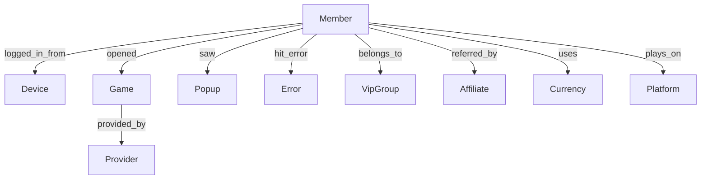

# Entity Extraction

## Overview

Entity extraction converts flat document fields into graph nodes and edges. It runs as part of the hot-path connector (P0 priority) and must keep pace with ingestion throughput.

## Entity Types



## Extraction Rules

### Member
- **Source field**: `memberCode`
- **Key**: `member:{memberCode}`
- **Properties**: `currency`, `rGroup`, `isTestAccount`
- **Present in**: All event types

### Device
- **Source field**: `fingerprint`
- **Key**: `device:{fingerprint}`
- **Properties**: `platform`, `os`, `osVersion`, `deviceModel`, `deviceManufacturer`, `deviceSize`, `browserSize`, `userAgent`
- **Present in**: All event types (when fingerprint is non-null)

### Game
- **Source field**: `gameUid` (preferred) or `game`
- **Key**: `game:{gameUid}` or `game:{game}`
- **Properties**: `category`, `gameTrackingProvider`, `gameTrackingCategory`, `gameTrackingId`
- **Present in**: GameOpened, PopupModule (when game-related)

### Popup
- **Source field**: `componentId`
- **Key**: `popup:{componentId}`
- **Properties**: `popupType`, `componentType`, `componentTitle`, `componentPosition`
- **Present in**: PopupModule

### Error
- **Source field**: `error` + `stage`
- **Key**: `error:{error_hash}` (hash of error message to normalize)
- **Properties**: `error` (full message), `stage`, `status`, `page`
- **Present in**: API Error

### VipGroup
- **Source field**: `rGroup`
- **Key**: `vipgroup:{rGroup}`
- **Properties**: None (the group name is the entity)
- **Present in**: All event types

### Affiliate
- **Source fields**: `affiliateId` OR `affiliateid` OR `affiliateID` (normalized)
- **Key**: `affiliate:{affiliateId}`
- **Properties**: None
- **Present in**: All event types (when non-null)

### Currency
- **Source field**: `currency`
- **Key**: `currency:{currency}`
- **Properties**: None
- **Present in**: All event types

### Platform
- **Source field**: `platform`
- **Key**: `platform:{platform}`
- **Properties**: None
- **Present in**: All event types

### Provider
- **Source field**: `gameTrackingProvider`
- **Key**: `provider:{gameTrackingProvider}`
- **Properties**: None
- **Present in**: GameOpened

## Edge Derivation Rules

| Event Type | Edges Created |
|-----------|---------------|
| **Login** | Member→Device, Member→Platform, Member→Currency, Member→VipGroup, Member→Affiliate |
| **GameOpened** | Member→Game, Member→Device, Member→Platform, Game→Provider |
| **API Error** | Member→Error, Member→Device, Member→Platform |
| **PopupModule** | Member→Popup, Member→Device, Member→Platform |

## Field Normalization

Before extraction, fields are normalized:

```rust
fn normalize_field(field_name: &str, value: &str) -> Option<String> {
    match field_name {
        // Affiliate ID normalization (3 different spellings)
        "affiliateId" | "affiliateid" | "affiliateID" => {
            let v = value.trim();
            if v.is_empty() || v == "None" || v == "null" { None } else { Some(v.to_string()) }
        }
        // Boolean normalization
        "success" | "isTestAccount" | "isUSDT" => {
            match value.to_lowercase().as_str() {
                "true" | "1" | "yes" => Some("true".to_string()),
                "false" | "0" | "no" => Some("false".to_string()),
                _ => None,
            }
        }
        // General: trim and filter empty/null
        _ => {
            let v = value.trim();
            if v.is_empty() || v == "None" || v == "null" || v == "undefined" {
                None
            } else {
                Some(v.to_string())
            }
        }
    }
}
```

## Test Account Filtering

Events with `isTestAccount: "true"` are still ingested (for completeness) but:
- Their entities are tagged with `is_test: true`
- They are excluded from compute algorithms by default
- The dashboard can toggle test account visibility

## Performance

Entity extraction must be fast:

| Operation | Target Latency |
|-----------|---------------|
| Extract entities from 1 document | < 100 microseconds |
| Create/update graph edges for 1 document | < 50 microseconds per edge |
| Total hot-path per document | < 500 microseconds (excluding embedding) |

At 500K docs/sec ingest rate, this means the entity extractor must handle ~500K extractions/sec — achievable with in-memory hash lookups and no allocations on the fast path.
