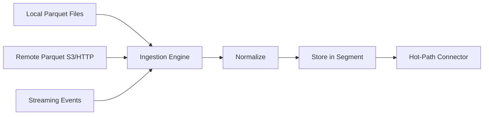

# Ingestion Overview

## Overview

The ingestion system is the single entry point for all data. It accepts parquet files (local or remote), streaming events, and SQL dumps, normalizes them into documents, and feeds them into the hot-path connector.

## Ingestion Sources



## Supported Input Formats

| Format | Source | Method |
|--------|--------|--------|
| **Parquet** (local) | `D:/w88_data/Login/2025-06-12.parquet` | File watcher or manual import |
| **Parquet** (remote) | `s3://bucket/Login/*.parquet` | Remote reader with range requests |
| **JSON** (streaming) | HTTP POST / WebSocket | Real-time event ingestion API |
| **CSV** | Local file | Batch import |
| **SQL dump** | `apicrm_db.sql` | Parse and convert to documents |

## Ingestion API

### Batch Import (Parquet)

```
POST /api/ingest/parquet
{
  "path": "D:/w88_data/Login/2025-06-12.parquet",
  "event_type": "Login"
}
```

### Directory Watch

```
POST /api/ingest/watch
{
  "path": "D:/w88_data/",
  "pattern": "**/*.parquet",
  "event_type_from_dir": true  // Derive event type from parent directory name
}
```

When `event_type_from_dir` is true:
- `D:/w88_data/Login/2025-06-12.parquet` → event_type = "Login"
- `D:/w88_data/GameOpened/2025-06-12.parquet` → event_type = "GameOpened"
- `D:/w88_data/API Error/2025-06-12.parquet` → event_type = "API Error"

### Streaming Event

```
POST /api/ingest/event
{
  "event_type": "Login",
  "timestamp": "2025-06-12T23:59:58.997Z",
  "fields": {
    "memberCode": "thongtran2904",
    "platform": "web-android",
    "currency": "VND",
    "success": "true"
  }
}
```

### Bulk Import (all sample data)

```
POST /api/ingest/bulk
{
  "path": "D:/w88_data/",
  "recursive": true,
  "file_pattern": "*.parquet",
  "event_type_from_dir": true,
  "parallel_files": 4
}
```

## Throughput

| Scenario | Target | Notes |
|----------|--------|-------|
| Parquet import (local) | 500K docs/sec | Sequential read, batch processing |
| Parquet import (remote) | 100K docs/sec | Network-bound |
| Streaming events | 50K events/sec | Per WebSocket connection |
| Bulk import (sample data) | ~10 min for 104GB | Parallel file reading |

## Error Handling

- Malformed documents are logged and skipped (not rejected)
- Missing mandatory fields (`@timestamp`) cause the document to be tagged with ingest time
- Duplicate detection: based on `(event_type, memberCode, @timestamp)` — configurable
- Failed remote reads are retried with exponential backoff
