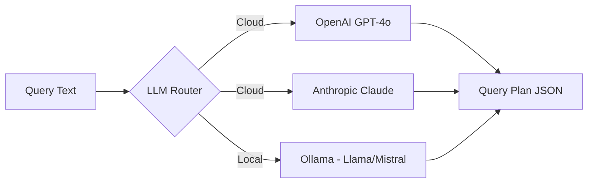
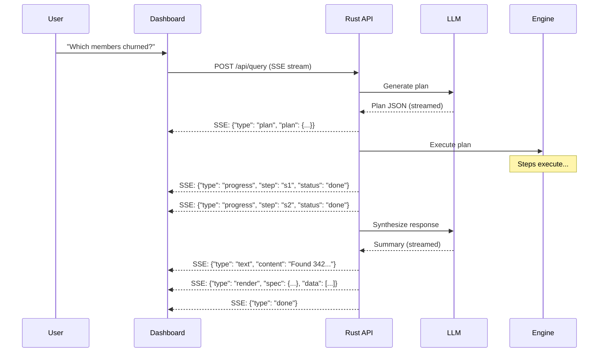

# LLM Integration

## Overview

The LLM layer serves two roles:
1. **Query planning** — translate natural language into structured query plans
2. **Response synthesis** — summarize results, pick visualizations, generate insights

## Supported Backends



### Configuration

```toml
[llm]
# Backend: "openai", "anthropic", "ollama"
backend = "openai"

[llm.openai]
api_key_env = "OPENAI_API_KEY"
model = "gpt-4o"
temperature = 0.1  # Low temp for structured output
max_tokens = 4096

[llm.anthropic]
api_key_env = "ANTHROPIC_API_KEY"
model = "claude-sonnet-4-5-20250929"
temperature = 0.1
max_tokens = 4096

[llm.ollama]
url = "http://localhost:11434"
model = "llama3.1:70b"  # Needs good model for structured output
temperature = 0.1
```

## Query Planning Prompt

The system prompt includes catalog context (see [catalog.md](./catalog.md)):

```
System: You are a query planner for stupid-db. Given a natural language question,
generate a structured query plan in JSON format.

{catalog_context}

Rules:
1. Output valid JSON matching the QueryPlan schema
2. Use the minimum number of steps needed
3. Prefer document.scan for simple lookups
4. Use graph.traverse when relationships are asked about
5. Use vector.search when similarity or "like this" is mentioned
6. Use compute.read for clusters, communities, anomalies, patterns
7. Always include at least one render instruction
8. Reference previous results with {"ref": "step_id", "field": "field_name"}
9. Time ranges default to last 7 days if not specified

User: {question}
Conversation context: {previous_results_summary}
```

## Response Synthesis Prompt

After the query plan executes and returns results:

```
System: You are a data analyst. Given query results, provide:
1. A concise text summary (2-5 sentences)
2. Key findings and numbers
3. Suggested follow-up questions
4. Any anomalies or surprises in the data

Results:
{step_results_json}

Original question: {question}
```

## Structured Output

For query planning, we use structured output (JSON mode / function calling):

### OpenAI

```rust
let response = openai.chat_completions()
    .model("gpt-4o")
    .response_format(json_schema!(QueryPlan))
    .messages(messages)
    .send()
    .await?;
```

### Anthropic

```rust
let response = anthropic.messages()
    .model("claude-sonnet-4-5-20250929")
    .tools(vec![query_plan_tool])
    .messages(messages)
    .send()
    .await?;
```

### Ollama

```rust
// Ollama doesn't have native structured output
// Use constrained generation with JSON prompt
let response = ollama.generate()
    .model("llama3.1:70b")
    .prompt(format!("{}\n\nRespond ONLY with valid JSON:\n```json\n", prompt))
    .send()
    .await?;
// Parse and validate JSON from response
```

## LLM Trait

```rust
#[async_trait]
trait LlmBackend: Send + Sync {
    /// Generate a query plan from natural language
    async fn generate_plan(
        &self,
        question: &str,
        catalog: &CatalogSummary,
        context: &[Message],
    ) -> Result<QueryPlan>;

    /// Synthesize a response from query results
    async fn synthesize_response(
        &self,
        question: &str,
        results: &StepResults,
        catalog: &CatalogSummary,
    ) -> Result<SynthesizedResponse>;

    /// Generate a label for a computed entity (cluster, community)
    async fn generate_label(
        &self,
        entity_type: &str,
        stats: &serde_json::Value,
    ) -> Result<String>;
}
```

## Streaming Responses

For the chat interface, responses are streamed:



## Cost Management

For OpenAI/Anthropic, track token usage:

```rust
struct LlmUsage {
    total_input_tokens: u64,
    total_output_tokens: u64,
    total_cost_usd: f64,
    queries_today: u64,
    avg_tokens_per_query: f64,
}
```

Display in dashboard for cost awareness. Ollama has zero marginal cost.

## Fallback Chain

If the primary LLM is unavailable:

```
OpenAI (primary) → Anthropic (secondary) → Ollama (local fallback)
```

Configurable. If all fail, return a structured error suggesting the user try a simpler query or check LLM configuration.

## Prompt Engineering Notes

- Keep catalog context concise — full schema dumps overwhelm the model
- Include 2-3 example query plans in the system prompt for few-shot learning
- Use low temperature (0.1) for plan generation, moderate (0.5) for summaries
- For Ollama, simpler prompts work better — avoid complex instructions
- Rate limit LLM calls: max 1 concurrent plan generation (serialize queries)
