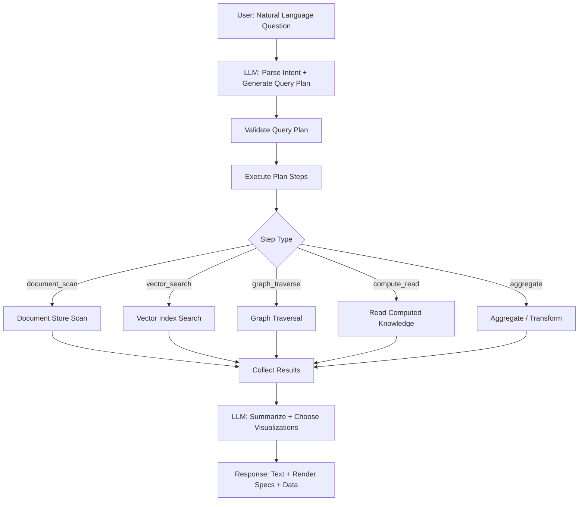
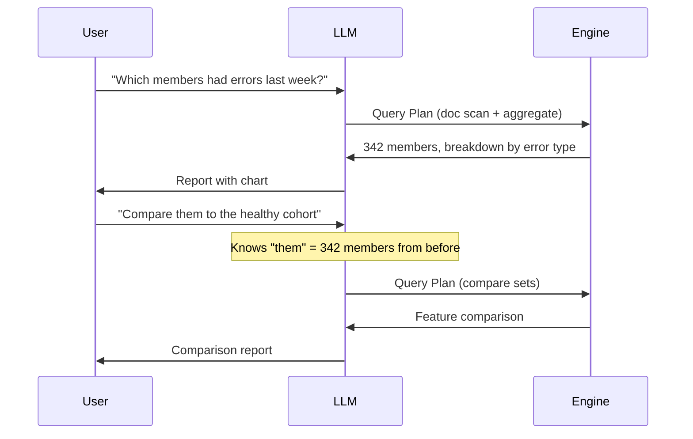

# Query System Overview

## Overview

The query system translates natural language questions into structured query plans that execute across all three stores (document, vector, graph) plus computed knowledge. Users never write SQL, Cypher, or vector search DSL — they talk to an AI that understands the data.

## Query Flow



## Conversation Context

Queries are stateful — follow-ups build on previous results:



The conversation context is managed by the query session:

```rust
struct QuerySession {
    id: SessionId,
    messages: Vec<Message>,
    // Named result sets from previous queries
    result_sets: HashMap<String, ResultSet>,
    // Last query's results (for "those", "them", "these")
    last_result: Option<ResultSet>,
    created_at: DateTime<Utc>,
}
```

## Components

- [Query Plan](./query-plan.md) — Structure and execution of query plans
- [Catalog](./catalog.md) — Knowledge catalog: what's available to query
- [LLM Integration](./llm-integration.md) — How the LLM generates and summarizes
