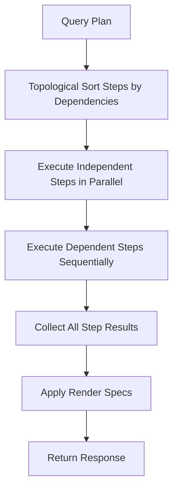

# Query Plan

## Overview

A query plan is a structured JSON document that describes what to fetch, compute, and render. The LLM generates query plans from natural language — the engine never executes raw SQL or unstructured queries.

## Plan Structure

```json
{
  "plan_id": "qp_abc123",
  "steps": [
    {
      "id": "s1",
      "store": "document",
      "op": "scan",
      "params": { ... }
    },
    {
      "id": "s2",
      "store": "graph",
      "op": "traverse",
      "depends_on": ["s1"],
      "params": { ... }
    }
  ],
  "render": [
    {
      "type": "summary",
      "data": "s2"
    }
  ]
}
```

## Step Types

### Document Scan

```json
{
  "id": "s1",
  "store": "document",
  "op": "scan",
  "params": {
    "event_type": "Login",
    "time_range": { "last": "7d" },
    "filter": {
      "success": "false",
      "platform": "web-android"
    },
    "project": ["memberCode", "@timestamp", "error", "platform"],
    "limit": 10000
  }
}
```

### Vector Search

```json
{
  "id": "s2",
  "store": "vector",
  "op": "search",
  "params": {
    "query_text": "mobile slot player with high error rate",
    "top_k": 100,
    "time_range": { "last": "7d" },
    "event_type_filter": "Login"
  }
}
```

### Graph Traverse

```json
{
  "id": "s3",
  "store": "graph",
  "op": "traverse",
  "params": {
    "start": { "ref": "s1", "field": "memberCode", "entity_type": "Member" },
    "edge_types": ["OpenedGame"],
    "direction": "outgoing",
    "depth": 1,
    "aggregate": "count"
  }
}
```

### Compute Read

```json
{
  "id": "s4",
  "store": "compute",
  "op": "read",
  "params": {
    "type": "cluster_info",
    "filter": { "member_set": { "ref": "s1", "field": "memberCode" } }
  }
}
```

### Aggregate / Transform

```json
{
  "id": "s5",
  "store": "compute",
  "op": "aggregate",
  "params": {
    "input": "s3",
    "group_by": "rGroup",
    "metrics": [
      { "field": "count", "agg": "sum" },
      { "field": "memberCode", "agg": "count_distinct" }
    ]
  }
}
```

### Filter / Join

```json
{
  "id": "s6",
  "store": "compute",
  "op": "filter",
  "params": {
    "input": "s1",
    "join": "s3",
    "join_key": "memberCode",
    "condition": "s3.count == 0"
  }
}
```

### Timeline

```json
{
  "id": "s7",
  "store": "compute",
  "op": "timeline",
  "params": {
    "input": "s1",
    "time_field": "@timestamp",
    "bucket": "1d",
    "metric": "count"
  }
}
```

## Render Specifications

The plan includes render instructions that the dashboard interprets:

```json
{
  "render": [
    {
      "type": "summary",
      "data": "s6",
      "title": "Members with errors who stopped playing"
    },
    {
      "type": "bar_chart",
      "data": "s7",
      "x": "bucket",
      "y": "count",
      "title": "Error-to-churn timeline"
    },
    {
      "type": "force_graph",
      "data": "s3",
      "title": "Affected member network"
    },
    {
      "type": "table",
      "data": "s6",
      "columns": ["memberCode", "rGroup", "error_count", "last_game"],
      "limit": 50
    }
  ]
}
```

## Execution Engine



### Execution Rules

1. Steps with no `depends_on` execute in parallel
2. Steps with dependencies wait for their inputs
3. Each step has a timeout (default: 30 seconds)
4. If a step fails, dependent steps are skipped and the error is reported
5. Partial results are returned — a failed step doesn't kill the whole plan

## Plan Validation

Before execution, plans are validated:

```rust
fn validate_plan(plan: &QueryPlan) -> Result<(), ValidationError> {
    // 1. All step IDs are unique
    // 2. All references (depends_on, ref) point to valid steps
    // 3. No circular dependencies
    // 4. Time ranges are within retention window
    // 5. Limits are within bounds (max 100K rows per step)
    // 6. Event types exist in schema registry
    // 7. Field names exist for referenced event types
}
```

## Plan Caching

Identical natural language queries with the same context can reuse plans:

```rust
struct PlanCache {
    cache: LruCache<u64, (QueryPlan, DateTime<Utc>)>,
    ttl: Duration, // Default: 5 minutes
}
```

The cache key is a hash of the normalized query text + conversation context.
